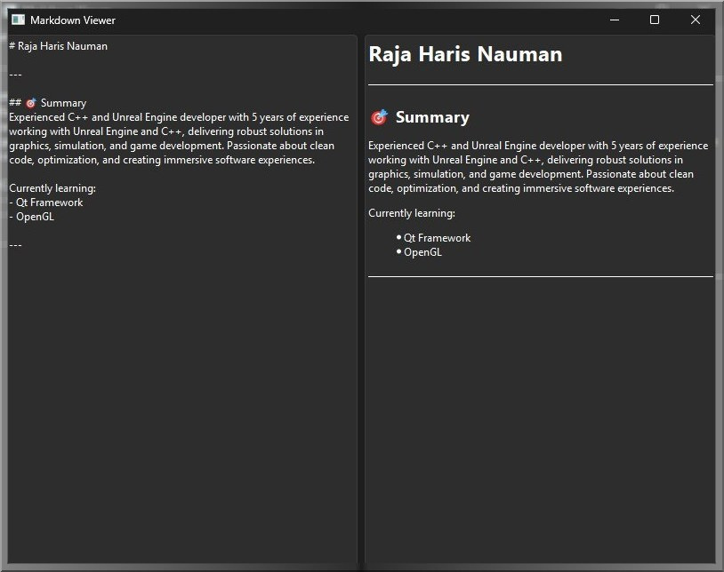

# Markdown Viwer
Made using Qt framework and C++ along with CMARK.  

## Usage
Type the Raw text in the left field and the output will appear in the right field.  

  

## Built With
- **Language**: C++ 17
- **Build System**: [CMake](https://cmake.org)
- **Third Party**: Qt-Framework
- **Platform**: Windows
